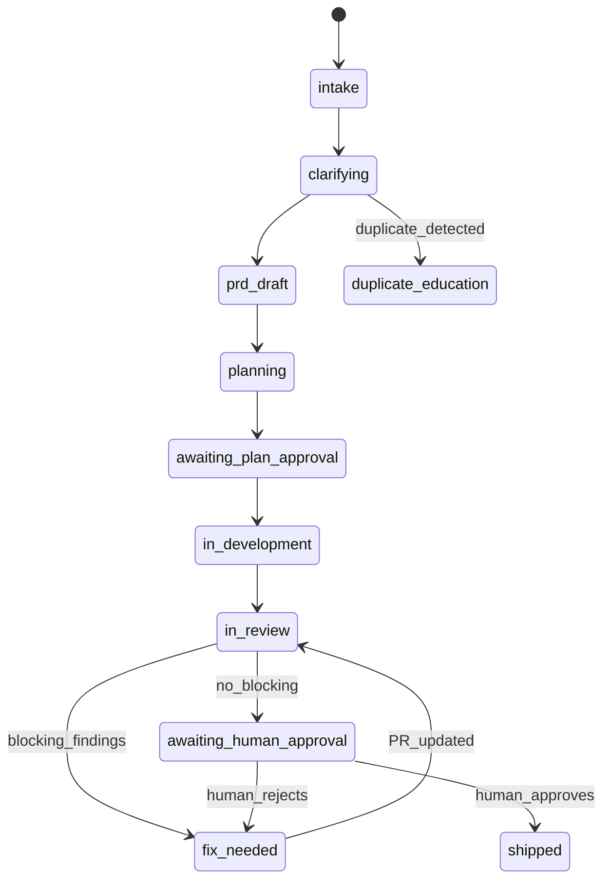
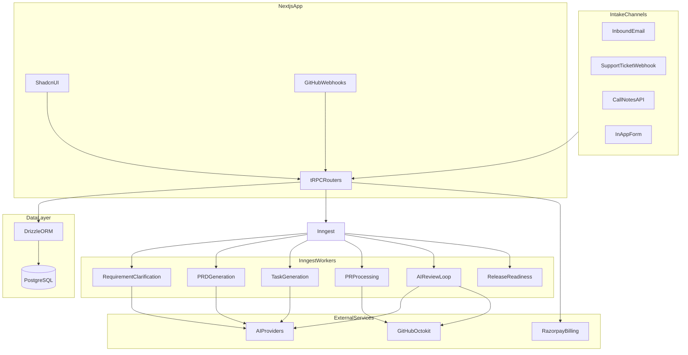

# ShipFlow AI — Project Context

> **Purpose:** Single source of truth for LLMs and developers working on this codebase. Read this file first before making any changes.
>
> **Source docs:** [init.md](./init.md) (product requirements), execution plan (phased build guide).
>
> **Current state:** Greenfield — only `init.md` and this file exist. No code scaffolded yet.

---

## 1. What Is ShipFlow?

**ShipFlow AI** is a full-stack SaaS platform that helps software teams move features from idea to production through a structured, AI-assisted workflow. It is not a code generator — it is a **product delivery orchestration platform** that manages the entire software delivery lifecycle.

**Tagline:** Request → Product Thinking → PRD → Tasks → Implementation → Review → Fixes → Approval → Release

**Target users:** Product owners, engineering teams, and customer-facing teams at modern software companies.

**Core value:** AI agents act as product thinkers and QA reviewers (not syntax checkers). Humans remain the final decision makers for release.

---

## 2. The Core Loop (Non-Negotiable)

Every feature must flow through this pipeline end-to-end:

```
Feature Request → Clarification → PRD → Tasks → Code (PR) → AI Review → Fixes → Re-Review → Human Approval → Shipped
```

This loop must be **testable with real GitHub PR data**. Hardcoded or mocked PR data is **not allowed**.

---

## 3. Workflow Phases

### Phase 1 — Product Discovery

- Feature requests arrive via **four intake channels** (all required in v1):
  - **In-app form** — dashboard submission
  - **Email** — inbound email webhook (Resend/SendGrid)
  - **Support ticket** — generic webhook (Zendesk/Intercom/Freshdesk-shaped adapters)
  - **Call notes** — REST endpoint for CS transcript/notes upload
- AI agent **clarifies missing requirements** via follow-up Q&A
- AI detects **duplicates** → educate user about existing offering (status: `duplicate_education`)
- AI detects **out-of-scope requests** → explain why, suggest alternatives
- Valid requests proceed to **PRD generation**

**PRD must include:**

- Problem statement
- Goals
- Non-goals
- User stories
- Acceptance criteria
- Edge cases
- Success metrics

### Phase 2 — Planning

- AI converts PRD into **engineering tasks**
- Tasks tracked on a **Kanban board** (`backlog` → `todo` → `in_progress` → `in_review` → `done`)
- Team lead **approves the plan** before development begins

### Phase 3 — Development

- GitHub repo connected via **GitHub App** (Octokit)
- Developers or coding agents implement against PRD
- Pull requests created and **linked to feature requests**
- Real PR metadata, changed files, and diffs fetched via Octokit

### Phase 4 — AI Review Loop

AI QA agent reviews PR against:

- PRD requirements and acceptance criteria
- Engineering tasks
- Security concerns
- Performance considerations
- Edge cases
- Code quality (requirement traceability, not syntax-only)

**Finding severity:**

- `blocking` — feature returns to `fix_needed`
- `non_blocking` — noted but does not block progress

On fix → PR updated → **automatic re-review** until no blocking issues remain.

AI reviews are **posted to GitHub** (Checks API or PR review comments).

### Phase 5 — Human Approval & Release

Human reviewer verifies: PRD, tasks, PR, AI review history, outstanding issues.

- **Approve** → status `shipped`
- **Reject** → back to `fix_needed` with human feedback

Only approved features can be marked **Shipped**.

---

## 4. Feature Status State Machine

```
intake → clarifying → prd_draft → planning → awaiting_plan_approval
  → in_development → in_review ↔ fix_needed → awaiting_human_approval → shipped

Side paths: rejected, duplicate_education
```



---

## 5. Technology Stack (Confirmed Choices)

| Layer      | Choice                          | Notes                                      |
| ---------- | ------------------------------- | ------------------------------------------ |
| Monorepo   | **Turborepo + pnpm workspaces** | Separate apps and packages                 |
| Web app    | **Next.js 15** (App Router)     | Deployed on Vercel                         |
| API        | **tRPC**                        | Type-safe; all client-server communication |
| UI         | **Shadcn UI**                   | Polished SaaS feel, dark/light mode        |
| Auth       | **BetterAuth**                  | Org plugin, RBAC                           |
| Database   | **PostgreSQL**                  | Neon/Supabase/Vercel Postgres              |
| ORM        | **Drizzle**                     | drizzle-kit migrations                     |
| Payments   | **Razorpay**                    | Subscriptions, webhooks                    |
| GitHub     | **Octokit + GitHub App**        | Webhooks, PR/diff fetch, review comments   |
| AI         | **Vercel AI SDK**               | Multi-provider (OpenAI, Anthropic, Google) |
| Async jobs | **Inngest**                     | All long-running AI/GitHub workflows       |
| Deployment | **Vercel**                      | Live deployment mandatory                  |

**Do not substitute** Prisma, MongoDB, or other ORMs/DBs unless explicitly re-decided.

---

## 6. Monorepo Structure

```
shipflow/
├── apps/
│   └── web/                    # Next.js 15 App Router
│       ├── app/                # Pages, API routes (webhooks, Inngest serve)
│       ├── server/             # tRPC routers, auth middleware, services
│       └── inngest/            # Inngest function definitions
├── packages/
│   ├── db/                     # Drizzle schema, migrations, client export
│   ├── api/                    # tRPC router definitions, shared procedures
│   ├── ai/                     # AI SDK providers, prompts, Zod output schemas
│   ├── github/                 # Octokit client, webhook verify, diff utils
│   ├── billing/                # Razorpay plans, webhooks, usage limits
│   ├── intake/                 # Channel normalizers → FeatureRequest
│   └── ui/                     # Shared Shadcn components (optional)
├── init.md                     # Original product requirements
├── project.md                  # This file — LLM context
├── plan.md                     # Phased execution plan
├── README.md                   # Setup, architecture, env vars (mandatory deliverable)
└── turbo.json
```

---

## 7. Database Schema (Drizzle / PostgreSQL)

All tables are **multi-tenant** — always filter by `organizationId`.

### Auth & Tenancy

| Table                                  | Purpose                           |
| -------------------------------------- | --------------------------------- |
| `user`, `session`, `account`           | BetterAuth                        |
| `organization`, `member`, `invitation` | Workspaces                        |
| `subscription`, `usage_record`         | Razorpay billing + metered limits |

### Product Domain

| Table                         | Purpose                                                            |
| ----------------------------- | ------------------------------------------------------------------ |
| `project`                     | Product area within org                                            |
| `repository`                  | GitHub repo + installation token                                   |
| `feature_request`             | Intake record; `source`: `in_app` \| `email` \| `ticket` \| `call` |
| `clarification_thread`        | AI Q&A messages during discovery                                   |
| `prd`, `prd_version`          | Structured PRD JSON + markdown + version history                   |
| `task`                        | Engineering tasks, Kanban status                                   |
| `pull_request`                | GitHub PR metadata, diff refs                                      |
| `ai_review`, `review_finding` | Review runs; severity: `blocking` \| `non_blocking`                |
| `approval`                    | Human sign-off                                                     |
| `workflow_run`                | Inngest job progress for UI                                        |
| `webhook_event`               | Idempotency for GitHub/Razorpay/intake webhooks                    |

### Key Enums

- **FeatureStatus:** `intake`, `clarifying`, `prd_draft`, `planning`, `awaiting_plan_approval`, `in_development`, `in_review`, `fix_needed`, `awaiting_human_approval`, `shipped`, `rejected`, `duplicate_education`
- **TaskStatus:** `backlog`, `todo`, `in_progress`, `in_review`, `done`
- **FindingSeverity:** `blocking`, `non_blocking`
- **MemberRole:** `owner`, `admin`, `member`, `reviewer`

---

## 8. tRPC Routers

| Router     | Responsibility                        |
| ---------- | ------------------------------------- |
| `auth`     | Session, profile                      |
| `org`      | Workspace CRUD, invites, member roles |
| `project`  | Projects within org                   |
| `feature`  | Feature requests, status transitions  |
| `prd`      | PRD CRUD, versioning                  |
| `task`     | Task CRUD, Kanban moves               |
| `github`   | Repo connect, PR link, webhook health |
| `review`   | AI reviews, findings, history         |
| `billing`  | Plans, checkout, usage                |
| `intake`   | Multi-channel intake endpoints        |
| `workflow` | Inngest run status, progress          |

**Procedures:**

- `publicProcedure` — unauthenticated
- `protectedProcedure` — requires session
- `orgProcedure` — requires org membership + enforces plan limits

---

## 9. Inngest Workflows

All long-running processes run via Inngest. Each function writes progress to `workflow_run` for UI visibility.

| Event                            | Function            | What It Does                                           |
| -------------------------------- | ------------------- | ------------------------------------------------------ |
| `feature/intake.received`        | `handle-intake`     | Normalize → dedupe → start clarification               |
| `feature/clarification.complete` | `generate-prd`      | AI generates structured PRD                            |
| `prd/approved`                   | `generate-tasks`    | AI breaks PRD into Kanban tasks                        |
| `pr/opened`                      | `process-pr`        | Fetch diff via Octokit → link feature → analyze repo   |
| `pr/updated`                     | `ai-review-pr`      | AI review → findings → GitHub comments → update status |
| `review/fixes-pushed`            | `ai-reReview-pr`    | Re-review after fixes                                  |
| `feature/ready-for-approval`     | `release-readiness` | Final AI pass → unlock human approval                  |

Local dev: `npx inngest-cli dev`. Production: Inngest sync endpoint at `/api/inngest`.

---

## 10. AI Configuration (`packages/ai`)

Multi-provider via Vercel AI SDK. Provider selected by `AI_PROVIDER` env var with optional fallback chain.

```typescript
// Pattern — packages/ai/src/providers.ts
const providers = {
  openai: openai("gpt-4o"),
  anthropic: anthropic("claude-sonnet-4-20250514"),
  google: google("gemini-2.0-flash"),
};
```

**AI-powered workflows:**

1. Requirement clarification (Q&A, duplicate detection, scope check)
2. PRD generation (structured JSON via Zod schema)
3. Task generation (linked to acceptance criteria)
4. Repository analysis (structure indexing, context cache)
5. Code review (requirement traceability matrix)
6. QA validation
7. Release readiness check

All AI outputs must use **structured output (Zod schemas)** where JSON is expected. Feedback must be **actionable** with explanations.

---

## 11. GitHub Integration (`packages/github`)

- Use a **GitHub App** (not OAuth-only) for repo access and webhooks
- Webhook events: `pull_request`, `pull_request_review`, `push`, `installation`
- Verify HMAC signatures; dedupe via `webhook_event` table
- On PR events: fetch metadata, changed files, unified diff via Octokit
- Link PR to feature by: branch naming (`shipflow/FR-{id}-*`), PR body template, or manual UI link
- Post AI review findings as GitHub PR comments or Checks

**Webhook URL:** `https://<domain>/api/webhooks/github`

---

## 12. Billing & Plan Limits (`packages/billing`)

Razorpay subscriptions with webhook handler for `subscription.activated` / `subscription.cancelled`.

| Limit                   | Free    | Paid      |
| ----------------------- | ------- | --------- |
| Repositories            | 1       | 10        |
| AI review credits/month | 10      | 500       |
| Projects                | 1       | unlimited |
| Premium workflows       | limited | full      |

Enforce limits in `orgProcedure` middleware. Show upgrade prompts in UI when limits hit.

---

## 13. UI Pages & Routes

| Page               | Route                         | Priority |
| ------------------ | ----------------------------- | -------- |
| Landing            | `/`                           | P0       |
| Auth               | `/auth/*`                     | P0       |
| Dashboard          | `/dashboard`                  | P0       |
| Workspace settings | `/settings/workspace`         | P0       |
| Projects           | `/projects`, `/projects/[id]` | P0       |
| Feature requests   | `/features`, `/features/[id]` | P0       |
| PRD editor         | `/features/[id]/prd`          | P0       |
| Task board         | `/features/[id]/tasks`        | P0       |
| GitHub integration | `/settings/github`            | P0       |
| PR reviews         | `/features/[id]/reviews`      | P0       |
| Review history     | `/features/[id]/history`      | P0       |
| Billing            | `/settings/billing`           | P0       |
| Final approval     | `/features/[id]/approval`     | P0       |

**Dashboard widgets:** features by status, recent AI reviews, Inngest workflow progress, usage/billing summary.

**PRD editor:** TipTap or similar; section sidebar; sync edits to DB; version history.

**Kanban:** dnd-kit drag-and-drop with optimistic tRPC updates.

---

## 14. Environment Variables

```bash
# App
DATABASE_URL=
BETTER_AUTH_SECRET=
BETTER_AUTH_URL=
NEXT_PUBLIC_APP_URL=

# AI (multi-provider)
AI_PROVIDER=openai|anthropic|google
OPENAI_API_KEY=
ANTHROPIC_API_KEY=
GOOGLE_GENERATIVE_AI_API_KEY=

# GitHub App
GITHUB_APP_ID=
GITHUB_APP_PRIVATE_KEY=
GITHUB_WEBHOOK_SECRET=
GITHUB_CLIENT_ID=
GITHUB_CLIENT_SECRET=

# Inngest
INNGEST_EVENT_KEY=
INNGEST_SIGNING_KEY=

# Razorpay
RAZORPAY_KEY_ID=
RAZORPAY_KEY_SECRET=
RAZORPAY_WEBHOOK_SECRET=

# Intake
INBOUND_EMAIL_WEBHOOK_SECRET=
TICKET_WEBHOOK_SECRET=
```

Never commit secrets. Maintain `.env.example` with all keys documented.

---

## 15. Implementation Order (Critical Path)

Build in this sequence — each step unblocks the next:

1. **Monorepo scaffold** — Turborepo, packages, TypeScript, ESLint, Prettier
2. **DB schema + migrations** — Drizzle, all core tables
3. **Auth + org tenancy** — BetterAuth, RBAC, tRPC context
4. **In-app feature requests** — tRPC CRUD, basic dashboard
5. **Inngest + AI clarification + PRD generation**
6. **Task generation + Kanban board + plan approval**
7. **GitHub App + webhooks + real PR fetch**
8. **AI review loop + GitHub comments + fix/re-review cycle**
9. **Human approval + shipped state**
10. **Email + ticket + call intake adapters**
11. **Razorpay billing + usage limits**
12. **Polish UI, landing page, deploy, README, demo video**

---

## 16. Coding Conventions

When implementing, follow these rules:

- **Minimize scope** — smallest correct diff; no unrelated changes
- **Match existing patterns** — naming, imports, abstractions in surrounding code
- **Multi-tenant isolation** — every query filters by `organizationId`
- **No hardcoded PR data** — always fetch from GitHub via Octokit
- **Structured AI output** — Zod schemas for PRD, tasks, findings
- **Idempotent webhooks** — log events in `webhook_event`, skip duplicates
- **Workflow visibility** — every Inngest function updates `workflow_run`
- **Type safety end-to-end** — tRPC + Drizzle + Zod; no `any`
- **Comments sparingly** — only for non-obvious business logic

---

## 17. Mandatory Deliverables

These are project requirements, not optional:

- [ ] Live deployment on Vercel
- [ ] Public GitHub repository
- [ ] Demo video (5–8 min full loop walkthrough)
- [ ] README with: overview, tech stack, architecture, setup, env vars, schema notes, GitHub setup, Inngest explanation, AI features
- [ ] Full core loop with **real GitHub PR data**
- [ ] All 5 workflow phases with visible status transitions
- [ ] Multi-tenant orgs with BetterAuth + RBAC
- [ ] All 4 intake channels
- [ ] Inngest workflow progress visible in UI
- [ ] Razorpay billing with enforced plan limits

---

## 18. Definition of Done (Per Feature/Task)

Before marking any implementation task complete:

1. Works end-to-end in local dev (DB migrated, Inngest dev running)
2. Respects org tenancy and plan limits where applicable
3. Has no hardcoded external data (GitHub, AI responses)
4. Status transitions are correct per state machine
5. UI shows loading/error states for async workflows
6. Types are consistent across tRPC ↔ Drizzle ↔ UI

---

## 19. Architecture Diagram



---

## 20. Quick Reference for LLMs

**"I'm starting fresh — what do I build first?"**
→ Turborepo monorepo → `packages/db` schema → BetterAuth → tRPC skeleton → dashboard shell.

**"I'm adding a new feature to the workflow"**
→ Check state machine (Section 4) → add DB table/migration if needed → tRPC router → Inngest function if async → UI page → update `workflow_run` progress.

**"I'm working on AI"**
→ All prompts live in `packages/ai`. Use Zod structured output. Select provider from env. Never call AI synchronously in tRPC — always via Inngest.

**"I'm working on GitHub"**
→ All Octokit logic in `packages/github`. Verify webhook signatures. No mock PR data. Link PRs to features explicitly.

**"I'm adding a page"**
→ Shadcn UI in `apps/web/app`. Use tRPC hooks. Protect with auth middleware. Filter by current org.

**"What must I never do?"**
→ Hardcode PR data, skip org tenancy filters, call AI synchronously in API routes, use Prisma/MongoDB, skip webhook idempotency, commit secrets.

---

_Last updated: project inception. Update this file when architecture decisions change or major milestones ship._
