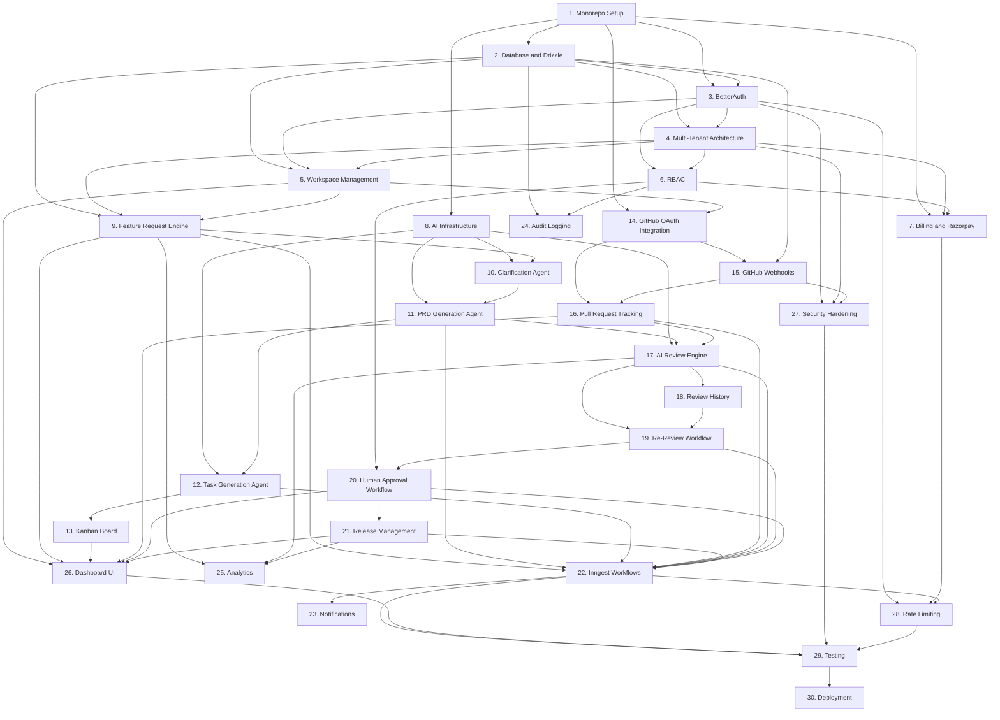

# ShipFlow AI — Implementation Tasks

Base repo: `piyushgarg-dev/trpc-monorepo` (pnpm + Turborepo, **Drizzle ORM** + Postgres, tRPC v11 with `trpc-to-openapi`, Express API app, Next.js 16 web app). Build order per task follows the stated convention: DB model (`packages/database`) → service (`packages/services`) → tRPC route (`packages/trpc/server`) → web hook (`apps/web/hooks`) → web component/page (`apps/web/app`).

No code, architecture narrative, or PRD content below — task breakdown only.

---

## Tasks

- **1. Monorepo Setup**
  - 1.1 Audit existing workspaces (`apps/web`, `apps/api`, `packages/database`, `packages/services`, `packages/trpc`, `packages/logger`) and confirm pnpm workspace boundaries
  - 1.2 Add `packages/ai` workspace package (Vercel AI SDK + Anthropic provider)
  - 1.3 Add `packages/billing` workspace package (Razorpay SDK)
  - 1.4 Add `packages/github` workspace package (Octokit + GitHub App auth)
  - 1.5 Add `packages/workflow` workspace package (Inngest client + functions)
  - 1.6 Add `packages/shared` workspace package for cross-cutting Zod schemas/enums/constants
  - 1.7 Register new packages in `pnpm-workspace.yaml` and wire `build`/`lint`/`check-types` into root `turbo.json`
  - 1.8 Add root `.env.example` consolidating every variable required across all packages
  - 1.9 Extend `docker-compose.yml` with a Redis service (rate limiting + Inngest dev) alongside existing Postgres
  - 1.10 Update `setup.sh` to document clean-clone bootstrap: install → docker up → db:generate → db:migrate → dev
  - **Requirements:** Monorepo Setup
  - **Dependencies:** None
  - **Acceptance Criteria:**
    - All new packages build via `turbo build` with no workspace resolution errors
    - Clean clone boots end-to-end using only `setup.sh` + documented commands
    - `.env.example` has zero undocumented variables referenced anywhere in code

- **2. Database & Drizzle**
  - 2.1 `packages/database/models/workspace.ts`
  - 2.2 `packages/database/models/membership.ts` (Role enum: OWNER/ADMIN/PRODUCT_MANAGER/ENGINEER/REVIEWER/VIEWER)
  - 2.3 `packages/database/models/project.ts`
  - 2.4 `packages/database/models/repository.ts`
  - 2.5 `packages/database/models/feature-request.ts` (+ `clarification-thread.ts`, `clarification-message.ts`, `duplicate-check-result.ts`)
  - 2.6 `packages/database/models/prd.ts` (+ `user-story.ts`, `acceptance-criterion.ts`, `epic.ts`)
  - 2.7 `packages/database/models/task.ts` (+ `subtask.ts`, `task-dependency.ts`)
  - 2.8 `packages/database/models/pull-request.ts` (+ `pull-request-file.ts`)
  - 2.9 `packages/database/models/review.ts` (+ `review-issue.ts`, `approval.ts`)
  - 2.10 `packages/database/models/release.ts`
  - 2.11 `packages/database/models/billing.ts` (subscription, usage-record, billing-event)
  - 2.12 `packages/database/models/audit-log.ts`, `webhook-event.ts`, `workflow-run.ts`
  - 2.13 Re-export every model from `packages/database/schema.ts`
  - 2.14 Define Drizzle `relations()` for all foreign keys (joins used by services)
  - 2.15 Run `db:generate`, review generated SQL under `packages/database/drizzle/`, run `db:migrate`
  - **Requirements:** Database & Drizzle, Multi-Tenant Architecture
  - **Dependencies:** Task 1
  - **Acceptance Criteria:**
    - `db:generate` produces migration SQL for every model with no manual SQL edits required
    - `db:migrate` applies cleanly against a fresh Postgres instance
    - Every tenant-scoped table has an indexed `workspaceId` column
    - All entities from the product spec are represented in `schema.ts`

- **3. BetterAuth**
  - 3.1 Install `better-auth` + its Drizzle adapter
  - 3.2 Create `packages/auth` wrapping a configured BetterAuth instance (supersedes the ad hoc `packages/services/clients/google-oauth.ts` stub)
  - 3.3 Point BetterAuth's Drizzle adapter at `packages/database`; add BetterAuth's required tables (user/session/account/verification) as Drizzle models
  - 3.4 Configure email/password provider
  - 3.5 Configure GitHub OAuth provider (user login — distinct from the GitHub App used for repo access in Task 14)
  - 3.6 Configure Google OAuth provider, migrating existing `google-oauth.ts` config; retire the stub once parity is confirmed
  - 3.7 Mount BetterAuth's handler in `apps/api` (Express) at `/auth/*`
  - 3.8 Build client/server session helpers in `apps/web` (`apps/web/lib/auth.ts`) for use in RSC and client components
  - 3.9 Replace the no-op `packages/trpc/server/context.ts` with real context that resolves the BetterAuth session and attaches `user` to `ctx`
  - 3.10 Extend `packages/trpc/server/routes/auth/route.ts` with `getSession`, `signOut` procedures alongside the existing `getSupportedAuthenticationProviders`
  - 3.11 Build login/signup/forgot-password pages in `apps/web/app`
  - **Requirements:** BetterAuth
  - **Dependencies:** Task 1, Task 2
  - **Acceptance Criteria:**
    - Email/password and OAuth (Google, GitHub) login work end-to-end against `apps/api`
    - `context.ts` resolves a real session instead of returning nothing
    - Existing `getSupportedAuthenticationProviders` procedure still passes, now backed by BetterAuth

- **4. Multi-Tenant Architecture**
  - 4.1 `packages/services/workspace/model.ts` — Zod schemas for workspace create/update/read
  - 4.2 `packages/services/workspace/index.ts` — `WorkspaceService` (`create`, `getBySlug`, `listForUser`)
  - 4.3 Build `requireWorkspaceContext` tRPC middleware in `packages/trpc/server/trpc.ts` resolving `workspaceId` and validating an active `Membership`
  - 4.4 Extend `context.ts` to carry the resolved `workspaceId` post-middleware
  - 4.5 Add a workspace-scoped query helper in `packages/database` used by every service to prevent unscoped queries
  - 4.6 Add a Postgres Row-Level-Security migration enabling RLS on every tenant table keyed by `workspaceId`
  - 4.7 Write an isolation test: two workspaces, cross-workspace query returns nothing
  - 4.8 Document the workspace resolution flow (slug → workspaceId → membership check) in the package README
  - **Requirements:** Multi-Tenant Architecture
  - **Dependencies:** Task 2, Task 3
  - **Acceptance Criteria:**
    - Cross-workspace data access is impossible at both the ORM and RLS layer
    - Every mutation procedure passes through `requireWorkspaceContext` before reaching a service
    - Isolation test passes in CI

- **5. Workspace Management**
  - 5.1 Add `workspace_invite` model (`invitedEmail`, `invitedRole`, `status`) to `packages/database/models/workspace.ts`
  - 5.2 Extend `packages/services/workspace/model.ts` + `index.ts` with `createInvite`, `acceptInvite`, `listMembers`, `updateMemberRole`, `removeMember`
  - 5.3 `packages/trpc/server/routes/workspace/route.ts` — `create`, `getBySlug`, `listMyWorkspaces`, `inviteMember`, `acceptInvite`, `listMembers`, `updateMemberRole`, `removeMember`
  - 5.4 Register `workspaceRouter` in `packages/trpc/server/index.ts`
  - 5.5 `apps/web/hooks/use-workspace.ts`, `use-workspace-members.ts`
  - 5.6 Components: workspace switcher, members table, invite dialog
  - 5.7 Workspace creation/onboarding page
  - 5.8 Transactional email for invites (provider decision required — flag as open item)
  - **Requirements:** Workspace Management
  - **Dependencies:** Task 2, Task 3, Task 4
  - **Acceptance Criteria:**
    - Create → invite → accept → correct role lands the user in the right workspace end-to-end
    - Member list and switcher reflect live data, not stale cache
    - `create`/`listMyWorkspaces` work prior to any workspace context existing (bootstrap case)

- **6. RBAC**
  - 6.1 Confirm `Role` enum on `Membership` matches the six required roles
  - 6.2 `packages/shared/permissions.ts` — static action → allowed-roles matrix
  - 6.3 Build `requirePermission(action)` tRPC middleware, composed after `requireWorkspaceContext`
  - 6.4 Apply `requirePermission` to every existing and new mutation procedure (ongoing checklist, not one-time)
  - 6.5 `apps/web/hooks/use-has-permission.ts` mirroring the server matrix for UI gating
  - 6.6 Hide/disable UI actions client-side per role, while treating server middleware as the real boundary
  - 6.7 Unit tests: full role × action matrix, expected allow/deny
  - **Requirements:** RBAC
  - **Dependencies:** Task 3, Task 4
  - **Acceptance Criteria:**
    - Every (role, action) pair in the matrix is covered by a passing test
    - A Viewer cannot invoke any gated mutation regardless of client-side state
    - Server enforcement is independent of and not bypassable via UI state

- **7. Billing & Razorpay**
  - 7.1 Install Razorpay Node SDK in `packages/billing`
  - 7.2 `packages/billing/plans.ts` — static FREE/PRO/ENTERPRISE config (limits, credit allotments)
  - 7.3 `packages/billing/client.ts` — Razorpay SDK wrapper
  - 7.4 `packages/services/billing/model.ts` + `index.ts` — `BillingService`: `createSubscription`, `getSubscriptionStatus`, `recordUsage`, `getCreditBalance`, `enforceCreditAvailable`
  - 7.5 `packages/trpc/server/routes/billing/route.ts` — `getPlans`, `createCheckoutSession`, `getSubscriptionStatus`, `getUsage`
  - 7.6 Raw-body Express route in `apps/api/src/server.ts` for the Razorpay webhook (signature verification needs unparsed body)
  - 7.7 `BillingEvent` idempotency check before processing any webhook
  - 7.8 `withCreditCheck(workspaceId, amount)` helper called before every AI-invoking service method
  - 7.9 `apps/web/hooks/use-subscription.ts`, `use-usage.ts`
  - 7.10 Billing settings page + upgrade/checkout components
  - 7.11 Plan-limit enforcement test (single repo on Free, multi-repo blocked)
  - 7.12 Webhook idempotency + credit-exhaustion tests
  - **Requirements:** Billing & Razorpay
  - **Dependencies:** Task 1, Task 4, Task 6
  - **Acceptance Criteria:**
    - Plan limits enforced server-side, never only in the UI
    - Razorpay webhooks are idempotent and are the sole source of truth for `Subscription.status`
    - AI calls are blocked, not degraded, at zero credit balance

- **8. AI Infrastructure**
  - 8.1 Install `ai` + `@ai-sdk/anthropic` (+ chosen embeddings provider) in `packages/ai`
  - 8.2 `packages/ai/provider.ts` — configured Anthropic client
  - 8.3 `packages/ai/schemas/` — Zod output schema per capability (clarification, duplicate-check, prd, tasks, review, release-readiness)
  - 8.4 `packages/ai/prompts/` — system prompt per capability, each requiring grounding in supplied requirement context
  - 8.5 `packages/ai/generate.ts` — wrapper around `generateObject` standardizing retries/error handling
  - 8.6 `packages/ai/embeddings.ts` — embedding client for duplicate-check corpus search
  - 8.7 `packages/ai/env.ts` — Zod-validated env (`ANTHROPIC_API_KEY`, embeddings key), matching existing package convention
  - 8.8 Unit tests with mocked provider responses asserting schema pass/fail behavior
  - **Requirements:** AI Infrastructure
  - **Dependencies:** Task 1
  - **Acceptance Criteria:**
    - Every AI capability returns a schema-validated object, never unparsed free text
    - A malformed model response fails validation loudly instead of silently passing through
    - Swapping model/provider requires editing only `provider.ts`

- **9. Feature Request Engine**
  - 9.1 `packages/database/models/feature-request.ts` finalized (Source/Status enums)
  - 9.2 `packages/services/feature-request/model.ts` + `index.ts` — `create`, `getById`, `listForProject`, `updateStatus`
  - 9.3 `packages/trpc/server/routes/feature-request/route.ts`
  - 9.4 Register router in `serverRouter`
  - 9.5 Service emits a `feature_request.created` event after persisting (consumed once Task 22 lands)
  - 9.6 `apps/web/hooks/use-feature-requests.ts`, `use-create-feature-request.ts`
  - 9.7 Intake form (Form/Support Ticket/Email/Manual sources) + list view components
  - 9.8 Page: `/[workspaceSlug]/projects/[projectId]/requests`
  - **Requirements:** Feature Request Engine
  - **Dependencies:** Task 2, Task 4, Task 5
  - **Acceptance Criteria:**
    - All four intake sources can create a `FeatureRequest`
    - List/detail views are correctly workspace/project scoped
    - Status transitions persist and render correctly

- **10. Requirement Clarification Agent**
  - 10.1 `clarification-thread.ts`, `clarification-message.ts` models finalized
  - 10.2 `packages/ai/schemas/clarification.ts` + prompt
  - 10.3 `packages/services/clarification/model.ts` + `index.ts` — `runClarificationCheck`, `postHumanReply`, `resolveThread`
  - 10.4 `packages/trpc/server/routes/clarification/route.ts` — `getThread`, `postReply`, `resolve`
  - 10.5 Inngest function stub identified for later wrapping (`featureRequest/clarify`, wired in Task 22)
  - 10.6 `apps/web/hooks/use-clarification-thread.ts`
  - 10.7 Clarification chat panel component on the request detail page
  - 10.8 Status transition wiring: `NEW → CLARIFYING → (resolved)`
  - **Requirements:** Requirement Clarification Agent
  - **Dependencies:** Task 8, Task 9
  - **Acceptance Criteria:**
    - Incomplete requests reliably trigger AI-generated clarification questions
    - Human replies persist and render in a threaded view
    - Resolving the thread unblocks progression to duplicate-check/PRD

- **11. PRD Generation Agent**
  - 11.1 `duplicate-check-result.ts`, `prd.ts`, `user-story.ts`, `acceptance-criterion.ts`, `epic.ts` models finalized
  - 11.2 `packages/ai/schemas/duplicate-check.ts` + `packages/ai/schemas/prd.ts` + prompts
  - 11.3 `packages/services/duplicate-check/index.ts` — embedding search + LLM judgment, returns NEW/DUPLICATE/EXISTING_CAPABILITY
  - 11.4 `packages/services/prd/model.ts` + `index.ts` — `generate` (gated on duplicate-check), `getById`, `update`, `approve`
  - 11.5 `packages/trpc/server/routes/duplicate-check/route.ts` and `routes/prd/route.ts`
  - 11.6 Inngest function stubs identified (`featureRequest/duplicate-check`, `prd/generate`, wired in Task 22)
  - 11.7 `apps/web/hooks/use-duplicate-check.ts`, `use-prd.ts`
  - 11.8 PRD editor page covering all required sections (Problem Statement → Risks & Assumptions)
  - 11.9 "Already exists" resolution UI — link matched feature, close request
  - 11.10 Status transitions: `PRD_GENERATING → PRD_READY` or `DUPLICATE_RESOLVED`
  - **Requirements:** PRD Generation Agent, Existing Capability Detection
  - **Dependencies:** Task 8, Task 10
  - **Acceptance Criteria:**
    - Duplicate/existing-capability requests are flagged and closed with a link, never silently dropped
    - Generated PRD contains every required section
    - PRD edits persist independently of the original AI-generated version

- **12. Task Generation Agent**
  - 12.1 `task.ts`, `subtask.ts`, `task-dependency.ts` models finalized
  - 12.2 `packages/ai/schemas/task-generation.ts` + prompt (epics → tasks → subtasks with dependency mapping in one pass)
  - 12.3 `packages/services/task/model.ts` + `index.ts` — `generateFromPRD`, `listForProject`, `updateStatus`, `updatePriority`, `addDependency`
  - 12.4 `packages/trpc/server/routes/task/route.ts`
  - 12.5 `approvePlan` procedure gating `PLANNING → IN_DEVELOPMENT`, restricted to PM/Admin/Owner
  - 12.6 Inngest function stub identified (`plan/generate-tasks`, wired in Task 22)
  - 12.7 `apps/web/hooks/use-tasks.ts`, `use-generate-tasks.ts`, `use-approve-plan.ts`
  - 12.8 Plan review screen showing generated epics/tasks pre-approval
  - **Requirements:** Task Generation Agent
  - **Dependencies:** Task 8, Task 11
  - **Acceptance Criteria:**
    - Approved PRDs generate epics/tasks/subtasks with dependency mapping in one pass
    - Generated tasks immediately populate the Kanban board
    - Plan approval gate blocks development until an authorized role approves

- **13. Kanban Board**
  - 13.1 `TaskService.moveStatus` enforcing valid status transitions and dependency checks
  - 13.2 Add `moveStatus` to `routes/task/route.ts`
  - 13.3 `apps/web/hooks/use-kanban-board.ts` (grouped by status, optimistic update)
  - 13.4 Drag-and-drop board component (one column per `TaskStatus`)
  - 13.5 Task detail drawer (description, priority, complexity, acceptance criteria, dependencies, subtasks)
  - 13.6 Page: `/[workspaceSlug]/projects/[projectId]/board`
  - 13.7 Board freshness via React Query invalidate-on-mutation
  - **Requirements:** Kanban Board
  - **Dependencies:** Task 12
  - **Acceptance Criteria:**
    - Tasks move between all six statuses with optimistic UI feedback
    - Invalid transitions (e.g., unmet dependency) are rejected server-side
    - Detail drawer correctly reflects acceptance criteria, dependencies, and subtasks

- **14. GitHub OAuth Integration**
  - 14.1 Install `@octokit/rest`, `@octokit/auth-app`, `@octokit/webhooks` in `packages/github`
  - 14.2 Register a GitHub App (manual, user-performed); document required permissions and webhook URL
  - 14.3 `packages/github/env.ts` — `APP_ID`, `PRIVATE_KEY`, `WEBHOOK_SECRET`, `CLIENT_ID/SECRET`
  - 14.4 `packages/github/app-auth.ts` — `createAppAuth` instance + `getInstallationOctokit(installationId)`
  - 14.5 `repository.ts` model finalized
  - 14.6 `packages/services/repository/model.ts` + `index.ts` — `startInstallation`, `completeInstallation`, `listForProject`, `getMetadata`
  - 14.7 `packages/trpc/server/routes/repository/route.ts`
  - 14.8 Express callback route in `apps/api` for the GitHub App installation redirect
  - 14.9 `apps/web/hooks/use-repositories.ts`, `use-connect-repository.ts`
  - 14.10 Repository connection page
  - **Requirements:** GitHub OAuth Integration
  - **Dependencies:** Task 1, Task 5
  - **Acceptance Criteria:**
    - A workspace admin can install the GitHub App and see the repo appear in ShipFlow
    - `githubInstallationId` is stored and used for every subsequent Octokit call
    - No repository data is hardcoded anywhere in the integration

- **15. GitHub Webhooks**
  - 15.1 Raw-body Express route `POST /webhooks/github` in `apps/api/src/server.ts` (separate from the global `express.json()` middleware)
  - 15.2 `packages/github/verify-signature.ts` — HMAC-SHA256 verification against `WEBHOOK_SECRET`
  - 15.3 `webhook-event.ts` model finalized (idempotency ledger)
  - 15.4 `packages/services/webhook/index.ts` — `recordAndDedupe(source, eventId)`
  - 15.5 Handler for `pull_request` (`opened`/`synchronize`/`closed`) delegating to Task 16
  - 15.6 Handler for `push`, triggering repository metadata refresh
  - 15.7 Emit downstream event after successful, deduped processing (consumed in Task 22)
  - 15.8 Tests: replayed delivery ID ignored; invalid signature rejected with 401
  - **Requirements:** GitHub Webhooks
  - **Dependencies:** Task 14, Task 2
  - **Acceptance Criteria:**
    - Duplicate deliveries are processed exactly once
    - Invalid signatures never reach business logic
    - `pull_request` and `push` events both produce expected downstream records

- **16. Pull Request Tracking**
  - 16.1 `pull-request.ts`, `pull-request-file.ts` models finalized
  - 16.2 `packages/services/pull-request/model.ts` + `index.ts` — `upsertFromWebhook`, `fetchFiles`, `fetchDiff` (always live, never cached), `listForRepository`, `listForFeatureRequest`
  - 16.3 `packages/trpc/server/routes/pull-request/route.ts`
  - 16.4 Link PR → FeatureRequest/Task via branch-naming convention or manual linking UI
  - 16.5 `apps/web/hooks/use-pull-requests.ts`, `use-pull-request-detail.ts`
  - 16.6 PR list + detail page
  - 16.7 Diff viewer component
  - **Requirements:** Pull Request Tracking
  - **Dependencies:** Task 14, Task 15
  - **Acceptance Criteria:**
    - File/diff data is always freshly fetched, never a stale snapshot
    - PR status stays in sync with GitHub via webhooks
    - PRs link correctly to their originating feature request/task where determinable

- **17. AI Review Engine**
  - 17.1 `packages/ai/schemas/review.ts` — `{ summary, reasoning, issues: ReviewIssue[] }`, each issue requiring `relatedAcceptanceCriterionId`
  - 17.2 `packages/ai/prompts/review.ts` — Product/Quality/Security/Performance/Edge-Case sections, explicit grounding instructions
  - 17.3 `review.ts`, `review-issue.ts` models finalized (`previousReviewId` self-relation)
  - 17.4 `packages/services/review/model.ts` + `index.ts` — `run(pullRequestId)`: assemble PRD+tasks+diff+files context, call AI, persist
  - 17.5 Categorization logic: BLOCKING vs NON_BLOCKING, compute `FIX_NEEDED`/`READY_FOR_APPROVAL`
  - 17.6 `packages/trpc/server/routes/review/route.ts` — `run`, `getById`, `getLatestForPullRequest`, `listIssuesByCategory`
  - 17.7 Inngest function stub identified (`review/run`, wired in Task 22)
  - 17.8 Call `withCreditCheck` (Task 7) before invoking AI review
  - 17.9 `apps/web/hooks/use-review.ts`, `use-review-issues.ts`
  - 17.10 Review results panel grouped by category, blocking visually distinct
  - 17.11 Issue detail card (linked acceptance criterion, file/line, recommendation)
  - 17.12 Tests: ungrounded issue fails schema validation; open BLOCKING issue forces `FIX_NEEDED`
  - **Requirements:** AI Review Engine
  - **Dependencies:** Task 8, Task 11, Task 16
  - **Acceptance Criteria:**
    - Every `ReviewIssue` is grounded in a specific acceptance criterion, no generic feedback
    - Status logic correctly reflects open BLOCKING issue count
    - A review run debits exactly one credit and is blocked at zero balance

- **18. Review History**
  - 18.1 `ReviewService.listCycles(pullRequestId)` walking the `previousReviewId` chain
  - 18.2 Add `listCycles` to `routes/review/route.ts`
  - 18.3 `apps/web/hooks/use-review-history.ts`
  - 18.4 Timeline component (cycle number, status, issue counts, timestamp)
  - 18.5 "Review History" tab on the PR detail page
  - 18.6 Every review run/status change logged to `AuditLog` (Task 24)
  - **Requirements:** Review History
  - **Dependencies:** Task 17
  - **Acceptance Criteria:**
    - Full cycle history is reconstructable from the stored chain
    - History view correctly shows cycle number, status, and issue counts
    - Every status change produces an audit entry

- **19. Re-Review Workflow**
  - 19.1 `ReviewService.rerun(pullRequestId)` — loads prior review + open BLOCKING issues as context, creates new cycle
  - 19.2 Add `rerun` to `routes/review/route.ts`
  - 19.3 Webhook handler (Task 15) routes new commits on a `FIX_NEEDED` PR to re-review instead of a fresh first review
  - 19.4 Inngest function stub identified (`review/rerun`, wired in Task 22)
  - 19.5 Extend the review schema (17.1) so the AI explicitly marks each prior BLOCKING issue resolved or still-open
  - 19.6 "Fix Needed" banner with outstanding blocking-issue checklist
  - 19.7 Loop-termination test: simulated multi-cycle fix sequence reaches `READY_FOR_APPROVAL`
  - **Requirements:** Re-Review Loop
  - **Dependencies:** Task 17, Task 18
  - **Acceptance Criteria:**
    - New commits on a `FIX_NEEDED` PR trigger re-review, not a fresh review
    - Each cycle explicitly resolves or re-raises prior BLOCKING issues
    - A correctly fixed PR reaches `READY_FOR_APPROVAL` without manual intervention

- **20. Human Approval Workflow**
  - 20.1 `approval.ts` model finalized
  - 20.2 `packages/ai/schemas/release-readiness.ts` + prompt (final automated gate)
  - 20.3 `packages/services/approval/model.ts` + `index.ts` — `evaluateReadiness`, `submitDecision` (role-gated via Task 6)
  - 20.4 `packages/trpc/server/routes/approval/route.ts` — `getReadiness`, `submitDecision`
  - 20.5 Inngest function stub identified (`release/readiness-evaluate`, wired in Task 22)
  - 20.6 `apps/web/hooks/use-approval-readiness.ts`, `use-submit-approval.ts`
  - 20.7 Approvals queue page with full context (PRD, tasks, PR, review history, AI findings)
  - 20.8 Decision routing: `APPROVED` → Release (Task 21); `REJECTED`/`CHANGES_REQUESTED` → back to `FIX_NEEDED`
  - **Requirements:** Human Approval Workflow
  - **Dependencies:** Task 6, Task 19
  - **Acceptance Criteria:**
    - Only Reviewer/Admin/Owner roles can submit a decision
    - Approval screen surfaces full context with no missing fields
    - Rejection correctly routes the PR back into the re-review loop

- **21. Release Management**
  - 21.1 `release.ts` model finalized
  - 21.2 `packages/services/release/model.ts` + `index.ts` — `create`, `getById`, `listForWorkspace`
  - 21.3 `packages/trpc/server/routes/release/route.ts`
  - 21.4 `FeatureRequest.status → SHIPPED` transition on release creation
  - 21.5 `apps/web/hooks/use-releases.ts`
  - 21.6 Release history page (PR reference, reviewer, timestamps, deployment metadata)
  - 21.7 Deployment metadata capture (commit SHA, merged-at timestamp) pulled from the PR record
  - **Requirements:** Release Management
  - **Dependencies:** Task 20
  - **Acceptance Criteria:**
    - Approval automatically produces a `Release` row with correct metadata
    - `SHIPPED` status is only reachable via an existing `Release` record
    - Release history page lists all releases accurately

- **22. Inngest Workflows**
  - 22.1 Install `inngest` in `packages/workflow`
  - 22.2 `packages/workflow/client.ts` — Inngest client + typed event schemas for every event referenced in Tasks 9–21
  - 22.3 `packages/workflow/functions/feature-request.ts` — `clarify`, `duplicate-check`
  - 22.4 `packages/workflow/functions/prd.ts` — `generate`
  - 22.5 `packages/workflow/functions/planning.ts` — `generate-tasks`
  - 22.6 `packages/workflow/functions/repository.ts` — `sync` (on-connect + daily cron)
  - 22.7 `packages/workflow/functions/pull-request.ts` — `process`
  - 22.8 `packages/workflow/functions/review.ts` — `run`, `rerun`
  - 22.9 `packages/workflow/functions/release.ts` — `readiness-evaluate`
  - 22.10 `packages/workflow/functions/billing.ts` — `process-webhook-event`
  - 22.11 Mount Inngest's serve handler in `apps/api` at `/api/inngest`
  - 22.12 `workflow-run.ts` model + write QUEUED→RUNNING→COMPLETED/FAILED rows from every function
  - 22.13 `apps/web/hooks/use-workflow-status.ts` (poll `WorkflowRun` by related entity)
  - 22.14 Progress indicator component attached to feature requests, PRDs, reviews
  - **Requirements:** Inngest Workflows
  - **Dependencies:** Task 9, Task 11, Task 12, Task 16, Task 17, Task 19, Task 20, Task 21
  - **Acceptance Criteria:**
    - Every long-running capability from Tasks 9–21 runs as a durable, retryable function
    - `WorkflowRun` status in the UI matches actual function state in near-real-time
    - A forced function failure surfaces as `Failed`, never silently swallowed

- **23. Notifications**
  - 23.1 `packages/services/notification/model.ts` + `index.ts` — channel-agnostic `send(workspaceId, userId, type, payload)`
  - 23.2 Channel decision: in-app (DB-backed) + email provider (flag as open item)
  - 23.3 `notification.ts` model
  - 23.4 `packages/trpc/server/routes/notification/route.ts` — `list`, `markRead`, `markAllRead`
  - 23.5 Wire trigger points: clarification posted, PRD ready, review `FIX_NEEDED`, approval requested, release shipped
  - 23.6 `apps/web/hooks/use-notifications.ts`
  - 23.7 Notification bell + dropdown in the app shell
  - **Requirements:** Notifications
  - **Dependencies:** Task 22
  - **Acceptance Criteria:**
    - Every listed trigger point produces exactly one notification
    - Unread count and mark-as-read behave correctly
    - Notifications are strictly workspace- and user-scoped

- **24. Audit Logging**
  - 24.1 `audit-log.ts` model finalized (from Task 2)
  - 24.2 `packages/services/audit/index.ts` — `record(workspaceId, actorId, action, entityType, entityId, metadata)`
  - 24.3 Generic tRPC middleware auto-calling `AuditService.record` after any successful mutation, reading the action name from `.meta`
  - 24.4 `packages/trpc/server/routes/audit/route.ts` — `listForWorkspace` (filter by entity type/actor/date range)
  - 24.5 `apps/web/hooks/use-audit-log.ts`
  - 24.6 Page: `/[workspaceSlug]/settings/audit-log`
  - 24.7 Confirm `@@index` on `(workspaceId, createdAt)` for query performance
  - **Requirements:** Audit Logging
  - **Dependencies:** Task 2, Task 6
  - **Acceptance Criteria:**
    - Every mutating action across the platform produces an audit row automatically
    - Audit log is filterable by actor, entity type, and date range
    - No mutation path exists that bypasses logging

- **25. Analytics**
  - 25.1 `packages/services/analytics/model.ts` + `index.ts` — requests-per-week, avg time-to-PRD, avg review cycles to approval, AI credit burn rate
  - 25.2 `packages/trpc/server/routes/analytics/route.ts` — `getWorkspaceOverview`, `getProjectThroughput`, `getReviewMetrics`
  - 25.3 `apps/web/hooks/use-analytics-overview.ts`
  - 25.4 Chart components (recharts) for throughput, review-cycle counts, credit usage
  - 25.5 Page: `/[workspaceSlug]/analytics`
  - 25.6 Short-TTL caching on aggregate queries
  - **Requirements:** Analytics
  - **Dependencies:** Task 9, Task 17, Task 21
  - **Acceptance Criteria:**
    - Metrics match manual counts against a test dataset
    - Charts render correctly with zero, sparse, and dense data
    - Aggregate queries don't measurably slow primary workspace pages

- **26. Dashboard UI**
  - 26.1 App shell layout: sidebar nav, workspace switcher, top bar (extends `apps/web/providers/global.tsx`)
  - 26.2 Landing/marketing page
  - 26.3 Auth pages finalized (ties to Task 3)
  - 26.4 Workspace dashboard home with summary cards (open requests, in-review PRs, pending approvals)
  - 26.5 Settings shell (general, members, billing, audit-log tabs)
  - 26.6 Responsive/empty-state pass across every list view from prior tasks
  - 26.7 Design-system gap check against existing shadcn/ui primitives, add any missing components
  - **Requirements:** Dashboard UI
  - **Dependencies:** Task 5, Task 9, Task 13, Task 16, Task 20, Task 21
  - **Acceptance Criteria:**
    - Every page in the product spec exists and is reachable via navigation
    - No blank/broken empty states anywhere in the app
    - Layout and theming are consistent across all pages

- **27. Security Hardening**
  - 27.1 Verify RLS policies (Task 4.6) active on every tenant table post-migration
  - 27.2 Audit every tRPC procedure for an explicit `.input()` schema (no implicit `any`)
  - 27.3 Audit secrets: confirm every key lives only in a package-local `env.ts`
  - 27.4 Re-verify webhook signature checks (GitHub Task 15, Razorpay Task 7)
  - 27.5 Add `helmet` middleware to `apps/api`; security headers in `apps/web`'s `next.config`
  - 27.6 Replace `apps/api`'s dev-only `origin: "*"` CORS with an explicit production allow-list
  - 27.7 Wire `pnpm audit` into CI
  - 27.8 Confirm BetterAuth cookies are `httpOnly`/`secure`/`sameSite` in production config
  - **Requirements:** Security Hardening
  - **Dependencies:** Task 3, Task 4, Task 15
  - **Acceptance Criteria:**
    - RLS verified active on every tenant table
    - No secret exists outside a package-local env file
    - Production CORS rejects any unlisted origin

- **28. Rate Limiting**
  - 28.1 Add Redis-backed sliding-window limiter (local: docker-compose service from Task 1.9; prod: Upstash)
  - 28.2 `packages/shared/rate-limit.ts` helper
  - 28.3 Apply 10 req/min/IP to BetterAuth's email/password endpoints
  - 28.4 AI-invoking procedures limited via credit balance (Task 7.8), not a separate Redis limiter
  - 28.5 Per-workspace Inngest concurrency limits for repository-sync and review functions
  - 28.6 Confirm webhook endpoints are exempt from rate limiting (idempotency-protected instead)
  - 28.7 Standard `429` + `Retry-After` header on limit breach
  - 28.8 Burst-request test against the auth endpoint
  - **Requirements:** Rate Limiting
  - **Dependencies:** Task 3, Task 7, Task 22
  - **Acceptance Criteria:**
    - Auth endpoints throttle correctly with proper `429`/`Retry-After`
    - AI endpoints are blocked purely by credit balance, never silently degraded
    - Webhook endpoints are never rate-limited, only deduplicated

- **29. Testing**
  - 29.1 Unit tests for every `packages/services/*/index.ts` method
  - 29.2 Formalize the RBAC permission-matrix test (Task 6.7)
  - 29.3 Unit tests for AI schema validation per capability (mocked provider responses)
  - 29.4 Integration tests: tRPC routers against a dedicated test Postgres database
  - 29.5 Integration tests: GitHub webhook signature + idempotency
  - 29.6 Integration tests: Razorpay webhook idempotency + subscription state transitions
  - 29.7 E2E test: full happy path (feature request → PRD → tasks → PR webhook → review → approval → release)
  - 29.8 Formalize the tenant-isolation test (Task 4.7)
  - 29.9 CI pipeline running lint, check-types, unit, and integration on every PR
  - 29.10 Coverage threshold gate on `packages/services` and `packages/ai`
  - **Requirements:** Testing
  - **Dependencies:** Task 22, Task 26, Task 27, Task 28
  - **Acceptance Criteria:**
    - CI blocks merge on any failing check
    - Coverage threshold met on services and AI packages
    - Full happy-path E2E passes consistently, not flakily

- **30. Deployment**
  - 30.1 Deploy `apps/web` to Vercel
  - 30.2 Deploy `apps/api` to a Node-compatible host (Railway/Render/Fly — it's an Express app serving `/trpc`, OpenAPI, and Scalar docs, not a Vercel serverless fit out of the box)
  - 30.3 Provision managed Postgres (Neon/Supabase) for production, replacing local docker-compose
  - 30.4 Provision managed Redis (Upstash) for production rate limiting
  - 30.5 Configure environment variables on both deploy targets from the Task 1.8 `.env.example`
  - 30.6 Point the GitHub App webhook URL at the deployed `apps/api` `/webhooks/github` endpoint
  - 30.7 Point the Razorpay webhook URL at the deployed endpoint
  - 30.8 Register the deployed `/api/inngest` endpoint with Inngest Cloud
  - 30.9 Run `db:migrate` against the production `DATABASE_URL` as a deploy step
  - 30.10 Smoke test: health check, auth flow, one full feature-request-to-PRD cycle on production
  - 30.11 Finalize README (setup, env vars, architecture, deployment guide)
  - **Requirements:** Deployment
  - **Dependencies:** Task 29
  - **Acceptance Criteria:**
    - Both `apps/web` and `apps/api` are live and reachable in production
    - GitHub App and Razorpay webhooks point at production, not localhost
    - A real feature request can be carried end-to-end to `SHIPPED` on the deployed environment

---

## Notes

- **ORM correction from the earlier architecture doc:** this repo uses **Drizzle**, not Prisma. All schema tasks use Drizzle conventions (`pgTable` models per file under `packages/database/models/`, `drizzle-kit generate`/`migrate`), not Prisma migrate.
- **Two backend surfaces exist, not one:** `apps/api` is a standalone Express app mounting the shared tRPC router twice — natively at `/trpc` and as REST/OpenAPI (via `trpc-to-openapi`, with Scalar docs at `/docs`). Webhooks (GitHub, Razorpay) are added as raw Express routes in `apps/api/src/server.ts`, not tRPC procedures, because signature verification needs the unparsed request body. `apps/web` is a separate Next.js app that only talks to `apps/api` over HTTP.
- **BetterAuth supersedes the existing stub:** the repo currently has a hand-rolled Google OAuth2 client (`packages/services/clients/google-oauth.ts`) with no session/membership model. Task 3 layers BetterAuth (with its official Drizzle adapter) on top of the existing database package and retires the stub once parity is confirmed — this satisfies the original "Use BetterAuth" requirement without throwing away the existing Drizzle setup.
- **Folder names corrected to match the actual repo:** your described `packages/db` and `packages/service` map to the real folders `packages/database` and `packages/services` (plural) — all tasks reference the real paths.
- **Per-feature subtask order matches your stated workflow:** within each feature task (9–21), subtasks run DB model → service (`model.ts` + `index.ts`) → tRPC route (registered in the server index) → web hook (`apps/web/hooks`) → web component/page, exactly as you described.
- **Inngest is a deliberate second pass, not green-field:** Tasks 9–21 build each AI/PR capability as a directly callable service method (invoked synchronously via tRPC for fast iteration and testability). Task 22 wraps the long-running/AI-invoking ones in durable, event-triggered Inngest functions, switching the relevant tRPC mutations from "call service, wait, return" to "emit event, return immediately, client polls `WorkflowRun`." This matches your own required ordering, where Inngest Workflows (22) follows the feature-engine tasks (9–21) rather than preceding them.
- **Open decisions still outstanding** from the prior architecture doc block specific tasks: managed Postgres provider (blocks Task 30.3), embeddings provider for duplicate-check (blocks Task 8.1/8.6), and GitHub App registration (blocks Task 14.2 — manual, on your side).
- The wave plan below reflects the **minimum sequential critical path** assuming one task in flight per wave. Tasks with looser actual dependencies than their thematic position (Notifications, Analytics, Dashboard polish, Security Hardening, Rate Limiting) can be pulled earlier by a larger team running tasks in parallel.

---

## Task Dependency Graph

---

## Execution Waves

| Wave | Tasks                                                                                             | Rationale                                                                                                                  |
| ---- | ------------------------------------------------------------------------------------------------- | -------------------------------------------------------------------------------------------------------------------------- |
| 1    | 1. Monorepo Setup                                                                                 | Nothing else can start without the workspace scaffold                                                                      |
| 2    | 2. Database & Drizzle, 8. AI Infrastructure                                                       | Both only need the monorepo scaffold; fully independent of each other                                                      |
| 3    | 3. BetterAuth                                                                                     | Needs DB models (sessions/accounts)                                                                                        |
| 4    | 4. Multi-Tenant Architecture                                                                      | Needs schema + a real session to resolve membership against                                                                |
| 5    | 5. Workspace Management, 6. RBAC                                                                  | Both need workspace-context middleware; independent of each other                                                          |
| 6    | 7. Billing & Razorpay, 9. Feature Request Engine, 14. GitHub OAuth Integration, 24. Audit Logging | All need workspace/RBAC foundation; no cross-dependencies among them                                                       |
| 7    | 10. Requirement Clarification Agent, 15. GitHub Webhooks                                          | Clarification needs AI infra + feature requests; webhooks need the GitHub App connection                                   |
| 8    | 11. PRD Generation Agent, 16. Pull Request Tracking, 27. Security Hardening                       | PRD needs resolved clarification; PR tracking needs webhooks flowing; hardening can start once auth/tenancy/webhooks exist |
| 9    | 12. Task Generation Agent, 17. AI Review Engine                                                   | Both need their respective upstream agent/data (PRD, PR+diff context)                                                      |
| 10   | 13. Kanban Board, 18. Review History                                                              | Board needs generated tasks; history needs at least one review cycle to exist                                              |
| 11   | 19. Re-Review Workflow                                                                            | Needs review history's cycle-chain logic in place                                                                          |
| 12   | 20. Human Approval Workflow                                                                       | Needs the re-review loop to actually reach a terminal `READY_FOR_APPROVAL` state                                           |
| 13   | 21. Release Management                                                                            | Needs an approval decision to act on                                                                                       |
| 14   | 22. Inngest Workflows, 25. Analytics, 26. Dashboard UI                                            | All consume completed functionality from Tasks 9–21; independent of each other                                             |
| 15   | 23. Notifications, 28. Rate Limiting                                                              | Both need the event/workflow layer (22) in place to hang triggers and concurrency limits off of                            |
| 16   | 29. Testing                                                                                       | Formal hardening/coverage pass once functional + security + rate-limit work is complete                                    |
| 17   | 30. Deployment                                                                                    | Final wave; gated on a passing test suite                                                                                  |
