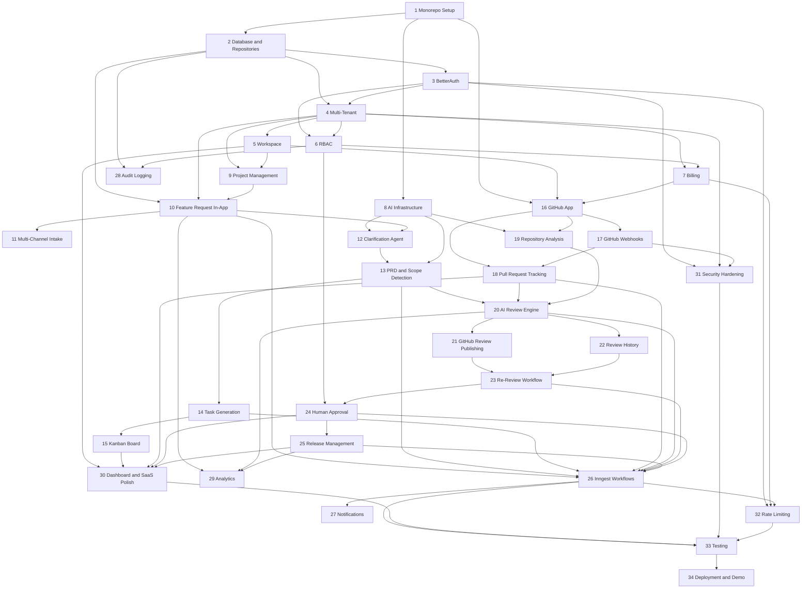

# ShipFlow AI — Implementation Plan (v1)

**Base repo:** [piyushgarg-dev/trpc-monorepo](https://github.com/piyushgarg-dev/trpc-monorepo)  
**Architecture source of truth:** [flow.md](./flow.md)  
**Product spec:** [project.md](./project.md) · [init.md](./init.md)

This plan replaces all prior architecture. Every task follows the layered flow:

```
Component → Hook → tRPC Router → Service → Repository → Database
Async:     Service → Inngest Event → Workflow → AI Agent → Repository
GitHub:    Webhook → packages/github → Workflow → AI Agent → Review Records → UI
```

**Non-negotiable:** No business logic in routers. No prompts in services. No direct tRPC calls from components. No hardcoded PR data.

---

## Monorepo Structure

```
apps/
└── web/                          # Next.js App Router — pages, hooks, API routes (webhooks, Inngest)

packages/
├── db/                           # Drizzle schema, client, repository layer, transactions
├── services/                     # Business logic, orchestration, workflow event emission
├── trpc/                         # Context, middleware, thin routers
├── shared/                       # Zod schemas, DTOs, enums, constants, permissions
├── ai/                           # AI agents + prompts only (services call agents)
├── github/                       # Octokit, webhooks, PR sync, review comment publishing
├── workflow/                     # Inngest client, events, durable functions
├── auth/                         # BetterAuth config, session helpers, permission utils
├── billing/                      # Razorpay, plans, credits, limit enforcement
└── ui/                           # Shared Shadcn wrappers, design-system primitives
```

### Package Boundaries

| Package    | Contains                                                                    | Must NOT contain                             |
| ---------- | --------------------------------------------------------------------------- | -------------------------------------------- |
| `db`       | Drizzle schema, repositories, query helpers, RLS migrations                 | Business logic, AI, GitHub, tRPC, UI         |
| `services` | Application services, validation, repo coordination, Inngest event emission | React, tRPC procedures, prompts, schema defs |
| `trpc`     | Context, middleware, thin routers                                           | Business logic                               |
| `shared`   | Zod schemas, enums, DTOs, constants                                         | Any I/O                                      |
| `ai`       | Agents (`agents/*.agent.ts`), prompts, `generateObject` wrapper             | DB access, tRPC                              |
| `github`   | Octokit, webhook verify, PR fetch, `review-comment.service.ts`              | Business orchestration                       |
| `workflow` | Inngest functions calling services/agents                                   | UI                                           |
| `auth`     | BetterAuth instance, session helpers                                        | Workspace business logic                     |
| `billing`  | Razorpay client, plan config, credit helpers                                | UI                                           |
| `ui`       | Reusable Shadcn components                                                  | Feature-specific pages                       |

### Frontend Structure (`apps/web`)

```
features/
├── workspace/       ├── project/          ├── feature-request/
├── prd/             ├── task-board/       ├── github/
├── review/          ├── release/           ├── billing/
└── settings/

hooks/               # use-* hooks only — components never call tRPC directly
app/                 # Routes, layouts, API routes (/api/webhooks/*, /api/inngest)
```

---

## Core Status Machine (aligned with project.md)

```
intake → clarifying → prd_draft → planning → awaiting_plan_approval
  → in_development → in_review ↔ fix_needed → awaiting_human_approval → shipped

Side paths: rejected, duplicate_education
```

**Task statuses:** `backlog` · `todo` · `in_progress` · `in_review` · `done`  
**Intake sources:** `in_app` · `email` · `ticket` · `call`  
**Member roles:** `owner` · `admin` · `member` · `reviewer` (extend with `engineer` · `viewer` if needed for RBAC matrix)

---

## Tasks

---

### Task 1 — Monorepo Setup

**Package Ownership:** root · `apps/web` · all `packages/*`

**Dependencies:** None

**Deliverables:**

- Audit base repo; rename `packages/database` → `packages/db` if needed
- Scaffold missing packages: `shared`, `ai`, `github`, `workflow`, `auth`, `billing`, `ui`
- Register all packages in `pnpm-workspace.yaml`; wire `turbo.json` (`build`, `lint`, `check-types`)
- Root `.env.example` with every env var documented
- `docker-compose.yml`: Postgres + Redis (rate limiting + Inngest dev)
- `setup.sh`: install → docker up → db:generate → db:migrate → dev
- Consolidate to **single app** (`apps/web`); migrate any Express-only routes to Next.js API routes

**Acceptance Criteria:**

- `turbo build` passes with zero workspace resolution errors
- Clean clone boots via `setup.sh` + documented commands
- `.env.example` has zero undocumented variables referenced in code

---

### Task 2 — Database Schema & Repositories

**Package Ownership:** `db` · `shared`

**Dependencies:** Task 1

**Deliverables:**

_Schema (`packages/db/schema/`):_

- Auth: `user`, `session`, `account`, `verification`
- Tenancy: `workspace`, `membership`, `workspace_invite`
- Domain: `project`, `repository`, `feature_request`, `clarification_thread`, `clarification_message`, `duplicate_check_result`
- PRD: `prd`, `prd_version`, `user_story`, `acceptance_criterion`, `epic`
- Planning: `task`, `subtask`, `task_dependency`
- GitHub: `pull_request`, `pull_request_file`, `repository_analysis` (cached repo index)
- Review: `review`, `review_issue`, `approval`
- Release: `release`
- Billing: `subscription`, `usage_record`, `billing_event`
- Cross-cutting: `audit_log`, `webhook_event`, `workflow_run`, `notification`
- Enums in `packages/shared/enums.ts` — single source of truth

_Repositories (`packages/db/repositories/`):_

- One repository per aggregate: `workspace.repository.ts`, `project.repository.ts`, `feature-request.repository.ts`, `prd.repository.ts`, `task.repository.ts`, `review.repository.ts`, `release.repository.ts`, etc.
- Workspace-scoped query helper used by every repository
- Drizzle `relations()` for all FKs
- RLS migration on every tenant table keyed by `workspaceId`
- `db:generate` + `db:migrate`; seed script with demo workspace

**Acceptance Criteria:**

- Migrations apply cleanly on fresh Postgres
- Every tenant table has indexed `workspaceId`
- Repository layer exposes CRUD only — no business rules
- All entities from product spec represented
- Feature status enum matches project.md state machine

---

### Task 3 — BetterAuth

**Package Ownership:** `auth` · `db` · `trpc` · `web`

**Dependencies:** Task 1, Task 2

**Deliverables:**

- `packages/auth/index.ts` — BetterAuth instance with Drizzle adapter
- Providers: email/password, GitHub OAuth (user login), Google OAuth
- Mount handler at `apps/web/app/api/auth/[...all]/route.ts`
- `packages/trpc/context.ts` — resolve session, attach `user` to ctx
- `packages/trpc/routers/auth.router.ts` — `getSession`, `signOut`, `getSupportedAuthenticationProviders`
- `apps/web/lib/auth.ts` — client/server session helpers
- Auth pages: login, signup, forgot-password
- Production cookie config: `httpOnly`, `secure`, `sameSite`

**Acceptance Criteria:**

- All three auth methods work end-to-end
- tRPC context resolves real session (not no-op)
- Retire any ad hoc OAuth stubs from base repo

---

### Task 4 — Multi-Tenant Architecture

**Package Ownership:** `shared` · `db` · `services` · `trpc`

**Dependencies:** Task 2, Task 3

**Deliverables:**

- `packages/services/workspace/create-workspace.service.ts`, `get-workspace.service.ts`, `list-workspaces.service.ts`
- `requireWorkspaceContext` middleware in `packages/trpc/trpc.ts` — slug → workspaceId → membership check
- Context carries `workspaceId` after middleware
- Tenant isolation integration test (two workspaces, cross-query returns nothing)
- README documenting resolution flow

**Acceptance Criteria:**

- Cross-workspace access blocked at repository + RLS layers
- Every workspace-scoped mutation passes through `requireWorkspaceContext`
- Isolation test passes in CI

---

### Task 5 — Workspace Management

**Package Ownership:** `db` · `services` · `trpc` · `web` · `ui`

**Dependencies:** Task 2, Task 3, Task 4

**Deliverables:**

- `workspace.repository.ts` — invite CRUD
- Services: `invite-member.service.ts`, `accept-invite.service.ts`, `list-members.service.ts`, `update-member-role.service.ts`, `remove-member.service.ts`
- `packages/trpc/routers/workspace.router.ts`
- Hooks: `use-workspace.ts`, `use-workspace-members.ts`
- UI: workspace switcher, members table, invite dialog, onboarding wizard (create workspace step)
- Page: `/[workspaceSlug]/settings/members`

**Acceptance Criteria:**

- Create → invite → accept → correct role → lands in workspace
- `create` / `listMyWorkspaces` work before workspace context exists (bootstrap)
- Switcher reflects live data

---

### Task 6 — RBAC

**Package Ownership:** `shared` · `auth` · `trpc` · `web`

**Dependencies:** Task 3, Task 4

**Deliverables:**

- `packages/shared/permissions.ts` — action → allowed-roles matrix (matches project.md RBAC table)
- `requirePermission(action)` middleware composed after `requireWorkspaceContext`
- Apply to every mutation procedure (ongoing checklist)
- `apps/web/hooks/use-has-permission.ts`
- UI gating: hide/disable actions per role (server is real boundary)
- Unit tests: full role × action matrix

**Acceptance Criteria:**

- Every (role, action) pair covered by passing test
- Viewer cannot invoke gated mutations regardless of client state

---

### Task 7 — Billing & Razorpay

**Package Ownership:** `billing` · `db` · `services` · `trpc` · `web`

**Dependencies:** Task 1, Task 4, Task 6

**Deliverables:**

- `packages/billing/plans.ts` — FREE/PRO/ENTERPRISE limits (repos, projects, AI credits)
- `packages/billing/client.ts` — Razorpay SDK wrapper
- `packages/billing/credits.ts` — `withCreditCheck(workspaceId, amount)`
- Services: `create-subscription.service.ts`, `record-usage.service.ts`, `get-credit-balance.service.ts`
- `packages/trpc/routers/billing.router.ts`
- Webhook: `apps/web/app/api/webhooks/razorpay/route.ts` (raw body, signature verify, idempotency via `billing_event`)
- Hooks: `use-subscription.ts`, `use-usage.ts`
- Billing settings page + upgrade prompts when limits hit
- Tests: plan limits, webhook idempotency, credit exhaustion

**Acceptance Criteria:**

- Plan limits enforced server-side only
- Razorpay webhooks are sole source of truth for subscription status
- AI calls blocked (not degraded) at zero credits

---

### Task 8 — AI Infrastructure

**Package Ownership:** `ai` · `shared`

**Dependencies:** Task 1

**Deliverables:**

- `packages/ai/provider.ts` — multi-provider via `AI_PROVIDER` env (`openai` | `anthropic` | `google`) with fallback chain
- `packages/ai/generate.ts` — `generateObject` wrapper (retries, validation errors)
- `packages/ai/embeddings.ts` — embedding client for duplicate detection
- `packages/ai/env.ts` — Zod-validated keys
- Agent files (prompts live inside agents, never in services):

```
packages/ai/agents/
├── clarification.agent.ts
├── scope-check.agent.ts          # duplicate + out-of-scope + existing-capability
├── repository-analysis.agent.ts
├── prd.agent.ts
├── task-planning.agent.ts
├── review.agent.ts
├── qa-validation.agent.ts
└── release-readiness.agent.ts
```

- Output schemas in `packages/shared/schemas/ai/` (used by agents + tests)
- Unit tests: mocked responses, schema pass/fail, golden-set fixtures for review agent

**Acceptance Criteria:**

- Every agent returns schema-validated objects only
- Malformed model response fails loudly
- Swapping provider requires editing only `provider.ts`
- Prompts exist only in `packages/ai/agents/`

---

### Task 9 — Project Management

**Package Ownership:** `db` · `services` · `trpc` · `web`

**Dependencies:** Task 4, Task 5

**Deliverables:**

- `project.repository.ts`
- Services: `create-project.service.ts`, `list-projects.service.ts`, `get-project.service.ts`, `archive-project.service.ts`
- `packages/trpc/routers/project.router.ts`
- Hooks: `use-projects.ts`, `use-create-project.ts`
- Pages: `/[workspaceSlug]/projects`, `/[workspaceSlug]/projects/[projectId]`
- Project card with feature count, connected repos, status summary

**Acceptance Criteria:**

- All feature requests scoped to a project
- Project list/detail workspace-scoped
- Empty state CTA: "Create your first project"

---

### Task 10 — Feature Request Engine (In-App Intake)

**Package Ownership:** `db` · `services` · `trpc` · `web` · `shared`

**Dependencies:** Task 2, Task 4, Task 9

**Deliverables:**

- `feature-request.repository.ts`
- `packages/shared/schemas/feature-request.ts` — intake DTOs
- Service: `create-feature-request.service.ts` — persists with `source: in_app`, status `intake`, emits `feature/intake.received`
- `packages/trpc/routers/feature-request.router.ts`
- Hooks: `use-feature-requests.ts`, `use-create-feature-request.ts`
- Feature module: intake form, list view, detail page with status timeline
- Page: `/[workspaceSlug]/projects/[projectId]/features`
- Status transition service enforcing state machine

**Acceptance Criteria:**

- In-app form creates request with status `intake`
- List/detail correctly workspace/project scoped
- Status transitions persist and render on timeline component

---

### Task 11 — Multi-Channel Intake

**Package Ownership:** `services` · `github` · `db` · `workflow` · `web`

**Dependencies:** Task 10

**Deliverables:**

- `packages/services/intake/normalize-intake.service.ts` — channel adapters → unified `FeatureRequest` shape
- `packages/services/intake/email-intake.adapter.ts` — Resend/SendGrid inbound webhook shape
- `packages/services/intake/ticket-intake.adapter.ts` — Zendesk/Intercom/Freshdesk-shaped payload
- `packages/services/intake/call-notes-intake.adapter.ts` — REST body for CS transcript upload
- API routes:
  - `apps/web/app/api/webhooks/intake/email/route.ts`
  - `apps/web/app/api/webhooks/intake/ticket/route.ts`
  - `apps/web/app/api/webhooks/intake/call-notes/route.ts`
- Signature verification + `webhook_event` idempotency on every route
- Source badge on feature request UI (`in_app` · `email` · `ticket` · `call`)
- Workflow trigger: normalized intake → `feature/intake.received` → clarification pipeline

**Acceptance Criteria:**

- All four intake channels create valid `FeatureRequest` rows
- Duplicate webhook deliveries ignored
- E2E includes at least one non-in-app channel

---

### Task 12 — Requirement Clarification Agent

**Package Ownership:** `db` · `services` · `ai` · `trpc` · `web`

**Dependencies:** Task 8, Task 10

**Deliverables:**

- Repositories: `clarification-thread.repository.ts`, `clarification-message.repository.ts`
- Service: `run-clarification.service.ts` — calls `clarification.agent.ts`, persists Q&A
- Service: `post-clarification-reply.service.ts`, `resolve-clarification.service.ts`
- `packages/trpc/routers/clarification.router.ts`
- Hook: `use-clarification-thread.ts`
- Clarification chat panel on feature detail page
- Status: `intake → clarifying →` (resolved, continues pipeline)

**Acceptance Criteria:**

- Incomplete requests trigger AI clarification questions
- Human replies persist in threaded view
- Resolving thread unblocks scope-check / PRD generation

---

### Task 13 — PRD Generation & Scope Detection

**Package Ownership:** `db` · `services` · `ai` · `trpc` · `web` · `ui`

**Dependencies:** Task 8, Task 12

**Deliverables:**

- Repositories: `duplicate-check-result.repository.ts`, `prd.repository.ts`, `prd-version.repository.ts`, `user-story.repository.ts`, `acceptance-criterion.repository.ts`, `epic.repository.ts`
- Service: `run-scope-check.service.ts` — calls `scope-check.agent.ts`
  - Resolutions: `NEW` · `DUPLICATE` · `EXISTING_CAPABILITY` · `OUT_OF_SCOPE`
  - `OUT_OF_SCOPE` → status `rejected` with alternatives[]
  - `DUPLICATE` / `EXISTING_CAPABILITY` → status `duplicate_education` with link
- Service: `generate-prd.service.ts` — calls `prd.agent.ts`, gated on scope = NEW
- Service: `update-prd.service.ts`, `approve-prd.service.ts`
- `packages/trpc/routers/prd.router.ts`, `scope-check.router.ts`
- Hooks: `use-prd.ts`, `use-scope-check.ts`, `use-generate-prd.ts`
- PRD editor (TipTap): section sidebar, all required sections, version history via `prd_version`
- Pages: `/[workspaceSlug]/projects/[projectId]/features/[featureId]/prd`
- Status: `clarifying → prd_draft` (or side paths)

**Acceptance Criteria:**

- Duplicate/out-of-scope requests flagged with education UI, never silently dropped
- Generated PRD contains: problem statement, goals, non-goals, user stories, acceptance criteria, edge cases, success metrics
- Manual edits persist as new `prd_version` rows
- Out-of-scope shows reasoning + suggested alternatives

---

### Task 14 — Task Generation Agent

**Package Ownership:** `db` · `services` · `ai` · `trpc` · `web`

**Dependencies:** Task 8, Task 13

**Deliverables:**

- Repositories: `task.repository.ts`, `subtask.repository.ts`, `task-dependency.repository.ts`
- Service: `generate-task-plan.service.ts` — calls `task-planning.agent.ts` (epics → tasks → subtasks + dependencies in one pass)
- Service: `approve-plan.service.ts` — gates `planning → awaiting_plan_approval → in_development` (PM/Admin/Owner)
- `packages/trpc/routers/task.router.ts`
- Hooks: `use-tasks.ts`, `use-generate-tasks.ts`, `use-approve-plan.ts`
- Plan review screen before approval
- Status: `prd_draft → planning → awaiting_plan_approval`

**Acceptance Criteria:**

- Approved PRD generates epics/tasks/subtasks with dependencies
- Plan approval blocks development until authorized role approves
- Generated tasks ready for Kanban

---

### Task 15 — Kanban Board

**Package Ownership:** `services` · `trpc` · `web` · `ui`

**Dependencies:** Task 14

**Deliverables:**

- Service: `move-task-status.service.ts` — valid transitions + dependency checks
- `task.router.ts` — add `moveStatus`
- Hook: `use-task-board.ts` — grouped by status, optimistic updates (dnd-kit)
- Board component: columns `backlog` · `todo` · `in_progress` · `in_review` · `done`
- Task detail drawer: description, priority, complexity, acceptance criteria, dependencies, subtasks
- Page: `/[workspaceSlug]/projects/[projectId]/features/[featureId]/tasks`

**Acceptance Criteria:**

- Drag-and-drop with optimistic UI + server rejection on invalid moves
- Unmet dependency blocks status advance server-side
- Detail drawer reflects all linked data

---

### Task 16 — GitHub App Integration

**Package Ownership:** `github` · `db` · `services` · `trpc` · `web`

**Dependencies:** Task 1, Task 5, Task 7

**Deliverables:**

- `packages/github/octokit.ts`, `packages/github/app-auth.ts`, `packages/github/env.ts`
- `repository.repository.ts`
- Service: `connect-repository.service.ts` — install flow, store `githubInstallationId`
- `packages/trpc/routers/github.router.ts`
- Callback: `apps/web/app/api/github/callback/route.ts`
- Hooks: `use-repositories.ts`, `use-connect-repository.ts`
- Page: `/[workspaceSlug]/settings/github`
- Branch naming helper UI: `shipflow/FR-{id}-feature-name`
- PR template generator: auto-fill PR body with feature link + acceptance criteria checklist
- Document GitHub App registration (permissions, webhook URL)

**Acceptance Criteria:**

- Admin installs GitHub App; repo appears in ShipFlow
- `githubInstallationId` used for every Octokit call
- Plan limit blocks extra repos on Free tier
- No hardcoded repository data

---

### Task 17 — GitHub Webhooks

**Package Ownership:** `github` · `db` · `workflow`

**Dependencies:** Task 16, Task 2

**Deliverables:**

- `packages/github/webhook.ts` — HMAC-SHA256 verify
- `apps/web/app/api/webhooks/github/route.ts` — raw body, separate from JSON parser
- Service: `record-webhook.service.ts` — idempotency via `webhook_event`
- Handlers: `pull_request` (opened/synchronize/closed), `push`, `installation`
- Emit Inngest events after deduped processing
- Tests: replay ignored, invalid signature → 401

**Acceptance Criteria:**

- Duplicate deliveries processed exactly once
- Invalid signatures never reach business logic
- Events produce downstream workflow triggers

---

### Task 18 — Pull Request Tracking

**Package Ownership:** `github` · `db` · `services` · `trpc` · `web`

**Dependencies:** Task 16, Task 17

**Deliverables:**

- `packages/github/pull-request.service.ts` — fetch files, unified diff (always live via Octokit, never cached/mock)
- Repositories: `pull-request.repository.ts`, `pull-request-file.repository.ts`
- Service: `upsert-pull-request.service.ts`, `link-pull-request.service.ts`
- Link PR → feature via: branch naming (`shipflow/FR-{id}-*`), PR body template, manual UI link
- `packages/trpc/routers/pull-request.router.ts`
- Hooks: `use-pull-requests.ts`, `use-pull-request-detail.ts`
- PR list + detail page with diff viewer
- Status: feature → `in_development` when PR linked; → `in_review` on first review trigger

**Acceptance Criteria:**

- File/diff always freshly fetched from GitHub
- PR status syncs via webhooks
- PRs link to originating feature where determinable

---

### Task 19 — Repository Analysis

**Package Ownership:** `github` · `ai` · `db` · `services` · `workflow`

**Dependencies:** Task 8, Task 16

**Deliverables:**

- `repository_analysis` table — cached tree, key configs, detected patterns
- Service: `analyze-repository.service.ts` — calls `repository-analysis.agent.ts`
- Workflow: `repository-sync.workflow.ts` (on-connect + daily cron)
- Feed analysis context into review agent prompts
- UI: repo analysis summary on settings/github page

**Acceptance Criteria:**

- Connected repo indexed within workflow run
- Review agent receives repo context (framework, patterns, conventions)
- Cache refreshed on push webhook

---

### Task 20 — AI Review Engine

**Package Ownership:** `ai` · `db` · `services` · `trpc` · `web` · `billing`

**Dependencies:** Task 8, Task 13, Task 18, Task 19

**Deliverables:**

- `review.agent.ts` — `{ summary, reasoning, issues[] }` with mandatory `relatedAcceptanceCriterionId` per issue
- `qa-validation.agent.ts` — separate pass for test coverage / requirement traceability
- Repositories: `review.repository.ts`, `review-issue.repository.ts`
- Service: `review-pr.service.ts` — assembles PRD + tasks + diff + files + repo analysis + prior review; calls agents; persists
- Categorization: `blocking` vs `non_blocking`; compute `fix_needed` vs `awaiting_human_approval`
- `withCreditCheck` before every AI invocation (1 credit per cycle)
- `packages/trpc/routers/review.router.ts`
- Hooks: `use-reviews.ts`, `use-review-issues.ts`
- Review panel grouped by category (Product/Security/Performance/Quality/Edge-Case)
- Issue cards: linked acceptance criterion, file/line, recommendation
- Tests: ungrounded issue fails schema; open blocking issue → `fix_needed`

**Acceptance Criteria:**

- Every issue grounded in a specific acceptance criterion — no generic feedback
- Agent acts as QA reviewer, not syntax checker
- Review debits exactly one credit; blocked at zero balance
- Feature status reflects review outcome

---

### Task 21 — GitHub Review Publishing

**Package Ownership:** `github` · `services`

**Dependencies:** Task 20

**Deliverables:**

- `packages/github/review-comment.service.ts`
- Post `ReviewIssue` as inline PR review comments (file + line where available)
- Summary comment: blocking vs non-blocking counts + link to ShipFlow
- GitHub Check Run: `fix_needed` → failure; ready → success/pending
- Sync check status on re-review cycles
- Called from `review-pr.service.ts` after persisting review

**Acceptance Criteria:**

- Opening PR on GitHub shows ShipFlow AI feedback without opening the app
- Inline comments map to file/line when data available
- Check run status matches ShipFlow review status

---

### Task 22 — Review History

**Package Ownership:** `services` · `trpc` · `web`

**Dependencies:** Task 20

**Deliverables:**

- Service: `list-review-cycles.service.ts` — walks `previousReviewId` chain
- `review.router.ts` — `listCycles`
- Hook: `use-review-history.ts`
- Timeline component: cycle number, status, issue counts, timestamp
- "Compare cycles" view on PR detail page
- Audit log entry on every review run/status change

**Acceptance Criteria:**

- Full cycle history reconstructable from stored chain
- Timeline accurate for multi-cycle PRs

---

### Task 23 — Re-Review Workflow

**Package Ownership:** `services` · `ai` · `github` · `workflow` · `web`

**Dependencies:** Task 20, Task 21, Task 22

**Deliverables:**

- Service: `rereview-pr.service.ts` — prior review + open blocking issues as context; new cycle
- Extend review agent schema: each prior blocking issue marked `resolved` | `still_open`
- Webhook routes `synchronize` on `fix_needed` PR → re-review (not fresh review)
- Workflow: `rereview-pr.workflow.ts`
- "Fix Needed" banner with outstanding blocking checklist
- Test: multi-cycle fix sequence reaches `awaiting_human_approval`

**Acceptance Criteria:**

- New commits on `fix_needed` PR trigger re-review automatically
- Each cycle explicitly resolves or re-raises prior blocking issues
- Correctly fixed PR reaches human approval gate without manual intervention

---

### Task 24 — Human Approval Workflow

**Package Ownership:** `ai` · `db` · `services` · `trpc` · `web`

**Dependencies:** Task 6, Task 23

**Deliverables:**

- `approval.repository.ts`
- Service: `evaluate-release-readiness.service.ts` — calls `release-readiness.agent.ts`
- Service: `submit-approval-decision.service.ts` — role-gated (reviewer/admin/owner)
- `packages/trpc/routers/approval.router.ts`
- Hooks: `use-approval-readiness.ts`, `use-submit-approval.ts`
- Approvals queue page with full context: PRD, tasks, PR, review history, AI findings, outstanding issues
- Decision routing: `approved →` release; `rejected` / `changes_requested → fix_needed` with human feedback fed into next re-review
- Status: `in_review → awaiting_human_approval`

**Acceptance Criteria:**

- Only authorized roles submit decisions
- Approval screen has zero missing context fields
- Rejection routes back into re-review loop with stored feedback

---

### Task 25 — Release Management

**Package Ownership:** `db` · `services` · `trpc` · `web`

**Dependencies:** Task 24

**Deliverables:**

- `release.repository.ts`
- Service: `approve-release.service.ts` — creates release, sets feature status `shipped`
- `packages/trpc/routers/release.router.ts`
- Hook: `use-release.ts`
- Release history page: PR reference, reviewer, timestamps, deployment metadata (commit SHA, merged-at)
- `shipped` only reachable via existing `release` record

**Acceptance Criteria:**

- Approval produces release row with correct metadata
- Release history accurate and workspace-scoped

---

### Task 26 — Inngest Workflows

**Package Ownership:** `workflow` · `db` · `services`

**Dependencies:** Tasks 10–25 (all async-capable services)

**Deliverables:**

```
packages/workflow/
├── client.ts
├── events.ts
└── workflows/
    ├── process-feature-request.workflow.ts   # intake → clarify
    ├── generate-prd.workflow.ts
    ├── generate-task-plan.workflow.ts
    ├── repository-sync.workflow.ts
    ├── review-pr.workflow.ts
    ├── rereview-pr.workflow.ts
    ├── release-readiness.workflow.ts
    └── process-billing-webhook.workflow.ts
```

- Mount: `apps/web/app/api/inngest/route.ts`
- Every workflow writes `workflow_run` rows: QUEUED → RUNNING → COMPLETED/FAILED
- tRPC mutations for long-running ops: emit event → return immediately → client polls
- Hook: `use-workflow-status.ts`
- Progress indicators on feature requests, PRDs, reviews (step labels: "Analyzing diff…", "Checking acceptance criteria…")
- Per-workspace concurrency limits on sync + review workflows

**Acceptance Criteria:**

- No AI call runs synchronously in tRPC — all via Inngest
- UI workflow status matches actual function state
- Forced failure surfaces as Failed, never swallowed

---

### Task 27 — Notifications

**Package Ownership:** `db` · `services` · `trpc` · `web`

**Dependencies:** Task 26

**Deliverables:**

- `notification.repository.ts`
- Service: `send-notification.service.ts` — in-app (DB) + email (provider TBD)
- Triggers: clarification posted, PRD ready, `fix_needed`, approval requested, shipped
- `packages/trpc/routers/notification.router.ts`
- Hook: `use-notifications.ts`
- Notification bell + dropdown in app shell

**Acceptance Criteria:**

- Every trigger produces exactly one notification
- Unread count + mark-as-read work correctly
- Strictly workspace- and user-scoped

---

### Task 28 — Audit Logging

**Package Ownership:** `db` · `services` · `trpc` · `web`

**Dependencies:** Task 2, Task 6

**Deliverables:**

- `audit-log.repository.ts`
- Service: `record-audit.service.ts`
- tRPC middleware: auto-record after successful mutations (action from `.meta`)
- `packages/trpc/routers/audit.router.ts`
- Hook: `use-audit-log.ts`
- Page: `/[workspaceSlug]/settings/audit-log` (filter by actor, entity, date range)

**Acceptance Criteria:**

- Every mutation produces audit row automatically
- No mutation path bypasses logging

---

### Task 29 — Analytics

**Package Ownership:** `services` · `trpc` · `web` · `ui`

**Dependencies:** Task 10, Task 20, Task 25

**Deliverables:**

- Service: `get-analytics.service.ts` — requests/week, avg time-to-PRD, avg review cycles, AI credit burn
- `packages/trpc/routers/analytics.router.ts`
- Hook: `use-analytics-overview.ts`
- Charts (recharts): throughput, review cycles, credit usage
- Page: `/[workspaceSlug]/analytics`
- Short-TTL cache on aggregates

**Acceptance Criteria:**

- Metrics match manual counts on test dataset
- Charts handle zero/sparse/dense data
- No measurable slowdown on primary pages

---

### Task 30 — Dashboard UI & SaaS Polish

**Package Ownership:** `web` · `ui`

**Dependencies:** Tasks 5, 9, 15, 18, 24, 25

**Deliverables:**

- App shell: sidebar, workspace switcher, top bar, notification bell, command palette (⌘K)
- Landing/marketing page
- Workspace dashboard: summary cards (features by status, in-review PRs, pending approvals, workflow progress, usage/billing)
- Onboarding wizard: create workspace → connect GitHub → create project → first feature request
- Settings shell: general, members, GitHub, billing, audit-log
- Dark/light mode toggle
- Feature status timeline on detail pages
- Role-based dashboard variants (PM / Engineer / Reviewer views)
- Responsive pass + empty states with CTAs on every list view
- Skeleton loaders + toast notifications for workflow completion

**Acceptance Criteria:**

- Every P0 page from project.md exists and is navigable
- No blank/broken empty states
- Consistent theming across all pages
- Demo-ready polish

---

### Task 31 — Security Hardening

**Package Ownership:** all packages · `web`

**Dependencies:** Task 3, Task 4, Task 17

**Deliverables:**

- Verify RLS active on every tenant table
- Audit every tRPC procedure for explicit `.input()` Zod schema
- Secrets audit: every key in package-local `env.ts` only
- Re-verify webhook signatures (GitHub, Razorpay, intake)
- Security headers in `next.config.ts`
- Production CORS allow-list
- `pnpm audit` in CI
- Sentry error tracking + Pino structured logging

**Acceptance Criteria:**

- RLS verified on all tenant tables
- No secret outside env files
- Production CORS rejects unlisted origins

---

### Task 32 — Rate Limiting

**Package Ownership:** `shared` · `auth` · `web`

**Dependencies:** Task 3, Task 7, Task 26

**Deliverables:**

- `packages/shared/rate-limit.ts` — Redis sliding window (local: docker-compose; prod: Upstash)
- 10 req/min/IP on auth endpoints
- AI limited by credit balance (not separate Redis limiter)
- Webhook endpoints exempt (idempotency-protected)
- Standard `429` + `Retry-After` header
- Burst test on auth endpoint

**Acceptance Criteria:**

- Auth throttles correctly
- Webhooks never rate-limited

---

### Task 33 — Testing

**Package Ownership:** all packages

**Dependencies:** Task 26, Task 30, Task 31, Task 32

**Deliverables:**

- Unit tests: every service method
- RBAC matrix tests (Task 6)
- AI schema + golden-set tests (Task 8)
- Integration: tRPC routers against test Postgres
- Integration: GitHub webhook signature + idempotency
- Integration: Razorpay webhook + subscription transitions
- Integration: intake webhook adapters
- Tenant isolation test (Task 4)
- E2E: full happy path — **email/ticket intake → clarify → PRD → tasks → real GitHub PR → AI review on GitHub → fix → re-review → approval → shipped**
- CI: lint, check-types, unit, integration on every PR
- Coverage gate on `packages/services`, `packages/ai`, `packages/db/repositories`

**Acceptance Criteria:**

- CI blocks merge on any failing check
- Coverage threshold met
- E2E passes consistently (not flaky)

---

### Task 34 — Deployment & Launch Deliverables

**Package Ownership:** root · `web`

**Dependencies:** Task 33

**Deliverables:**

- Deploy `apps/web` to Vercel (Next.js + API routes + Inngest + webhooks)
- Managed Postgres (Neon/Supabase) + managed Redis (Upstash)
- Configure all env vars from `.env.example`
- GitHub App webhook → `https://<domain>/api/webhooks/github`
- Razorpay webhook → production endpoint
- Register Inngest Cloud sync at `/api/inngest`
- Production `db:migrate` as deploy step
- Smoke test: auth + one full intake-to-shipped cycle on production
- **Public GitHub repository**
- **Demo video (5–8 min):** full loop with real GitHub PR, AI comments visible on GitHub
- README with all mandatory sections:
  - overview · tech stack · architecture diagram · setup · env vars
  - database schema notes · GitHub App setup (screenshots) · Inngest explanation · AI features
  - live deployment URL · demo video link
- Seed script for judge demo workspace

**Acceptance Criteria:**

- Live deployment reachable
- Webhooks point at production
- Real feature request → `shipped` on production with real GitHub PR data
- Public repo + demo video linked in README

---

## Task Dependency Graph



---

## Execution Waves

| Wave | Tasks                                                        | Rationale                                 |
| ---- | ------------------------------------------------------------ | ----------------------------------------- |
| 1    | 1. Monorepo Setup                                            | Scaffold + package boundaries             |
| 2    | 2. Database & Repositories, 8. AI Infrastructure             | Independent foundations                   |
| 3    | 3. BetterAuth                                                | Needs auth tables                         |
| 4    | 4. Multi-Tenant Architecture                                 | Needs session + schema                    |
| 5    | 5. Workspace, 6. RBAC                                        | Parallel tenancy layer                    |
| 6    | 7. Billing, 9. Project Management, 28. Audit Logging         | Foundation for features                   |
| 7    | 10. Feature Request, 16. GitHub App                          | Core entities + GitHub connect            |
| 8    | 11. Multi-Channel Intake, 17. GitHub Webhooks                | All four intake channels + events flowing |
| 9    | 12. Clarification, 18. PR Tracking, 19. Repository Analysis  | Discovery + dev pipeline starts           |
| 10   | 13. PRD & Scope Detection, 31. Security Hardening            | PRD pipeline + hardening in parallel      |
| 11   | 14. Task Generation, 20. AI Review Engine                    | Planning + review core                    |
| 12   | 15. Kanban, 21. GitHub Review Publishing, 22. Review History | Board + GitHub-visible reviews            |
| 13   | 23. Re-Review Workflow                                       | Needs review + GitHub publishing          |
| 14   | 24. Human Approval, 25. Release Management                   | Final gates                               |
| 15   | 26. Inngest Workflows                                        | Wrap all async services                   |
| 16   | 27. Notifications, 29. Analytics, 30. Dashboard Polish       | UX layer                                  |
| 17   | 32. Rate Limiting                                            | Needs workflow layer                      |
| 18   | 33. Testing                                                  | Full suite                                |
| 19   | 34. Deployment & Demo                                        | Launch                                    |

---

## Notes

- **ORM:** Drizzle in `packages/db` (base repo convention). flow.md repository pattern applies; schema lives in `packages/db`, not services.
- **Single app:** `apps/web` only — tRPC via Next.js adapter, webhooks at `/api/webhooks/*`, Inngest at `/api/inngest`. No separate Express app.
- **Layer discipline:** Router → Service → Repository → DB. Services call AI agents; agents never touch DB directly.
- **Async discipline:** After Task 26, all AI/long-running tRPC mutations emit Inngest events and return immediately; UI polls `workflow_run`.
- **Open decisions:** Postgres provider (Neon vs Supabase), embeddings provider (Voyage vs OpenAI), email provider for invites/notifications, GitHub App registration (manual).
- **Estimated score if fully implemented:** 92–98 / 100 against project rubric.

---

## Rubric Coverage Map

| Rubric (pts)                      | Primary Tasks                            |
| --------------------------------- | ---------------------------------------- |
| Core Workflow (20)                | 10–15, 18, 24–25, 26, 33 E2E             |
| AI Agent Quality (20)             | 8, 12–14, 19–20, 23–24, golden-set tests |
| GitHub Integration (15)           | 16–18, 21, 17 webhooks                   |
| Review Loop & Human Approval (15) | 20–24                                    |
| tRPC Monorepo & Engineering (15)  | 1–7, 28, 31–33                           |
| SaaS Product Experience (10)      | 30, 7 upgrade prompts, 27 notifications  |
| Demo & Documentation (5)          | 34                                       |
